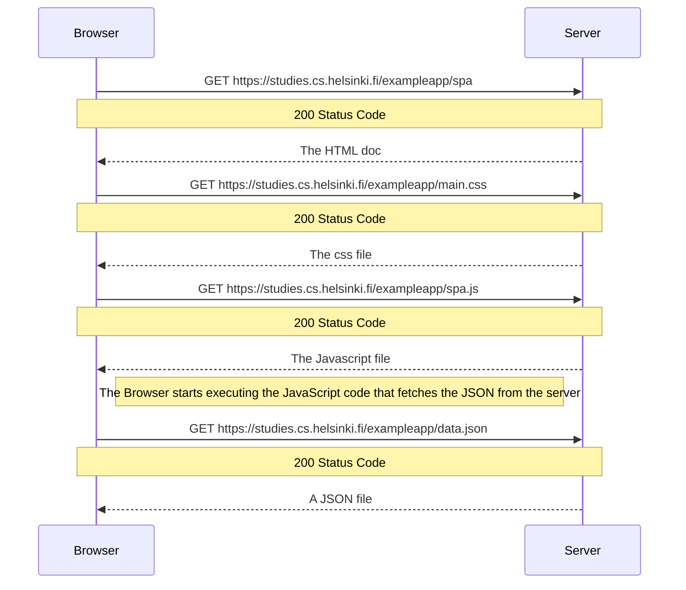

```mermaid
sequenceDiagram

Browser->>Server: GET https://studies.cs.helsinki.fi/exampleapp/spa
Note over Browser,Server: 200 Status Code
Server-->>Browser: The HTML doc

Browser->>Server: GET https://studies.cs.helsinki.fi/exampleapp/main.css
Note over Browser,Server: 200 Status Code
Server-->>Browser: The css file

Browser->>Server: GET https://studies.cs.helsinki.fi/exampleapp/spa.js
Note over Browser,Server: 200 Status Code
Server-->>Browser: The Javascript file

Note right of Browser: The Browser starts executing the JavaScript code that fetches the JSON from the server

Browser->>Server: GET https://studies.cs.helsinki.fi/exampleapp/data.json
Note over Browser,Server: 200 Status Code
Server-->>Browser: A JSON file
```
